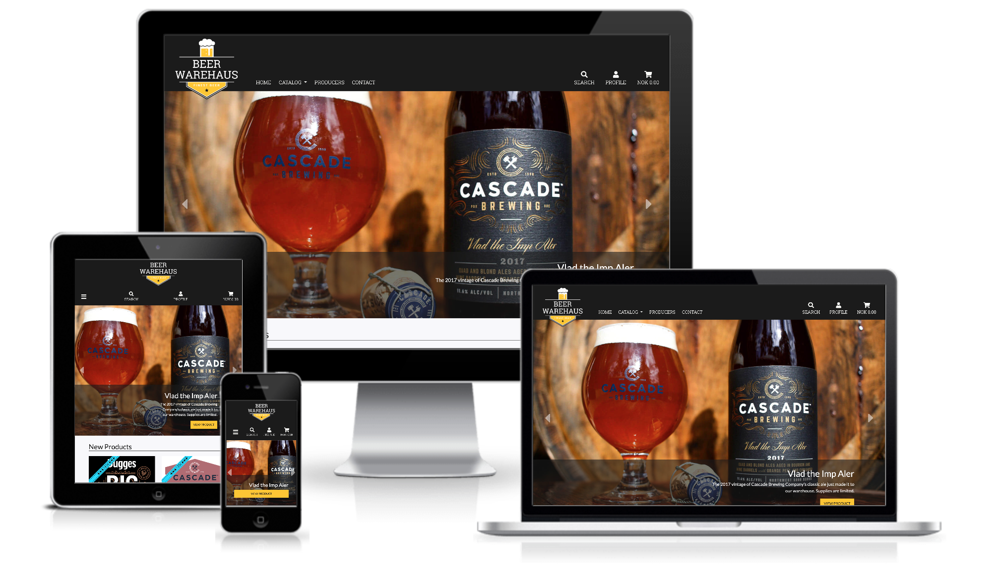
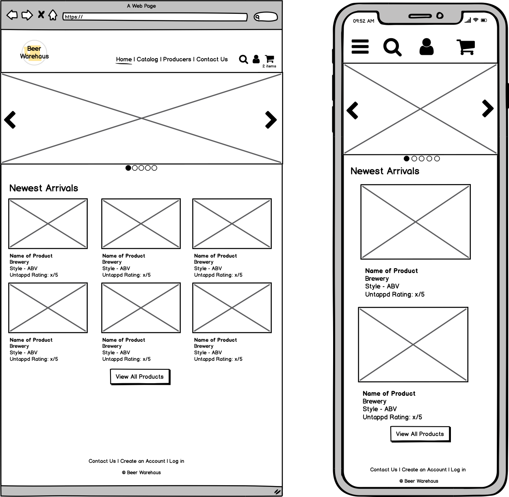
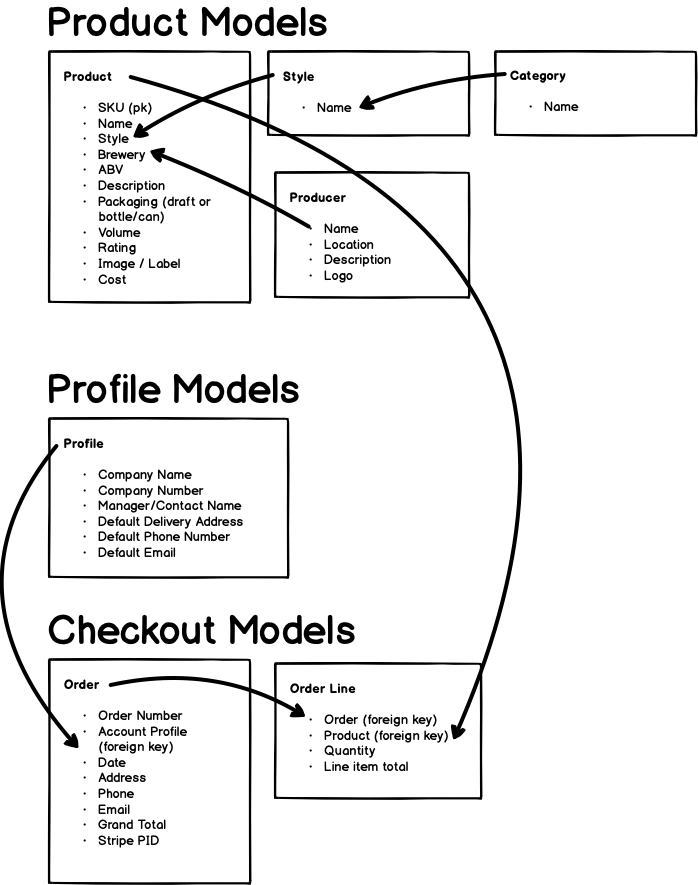
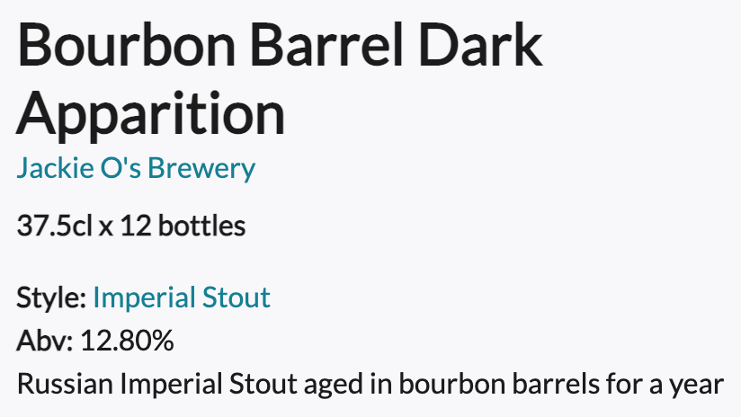

# Beer WareHaus

Beer WareHaus is an online shop for a hypothetical beer import and distribution company in Norway. The purpose of the site is to provide a simple intuitive ways for managers of bars and restaurants to browse and purchase products they wish to serve.
Additionally the site provides a number of tools allowing the shop owner to easily manage the products in the shop.



The site has been deployed to Heroku and can be viewed [here](https://beer-warehaus.herokuapp.com/).

## UX

### Project Goal

This project is my fourth and final Milestone Project in the Code Institute's Fullstack Development program. The purpose of this project was to create an e-commerce site using the Django framework, static file hosting with AWS, and a functional payment system with Stripe. This e-commerce site is fully functional and could be used by a real beer distribution company with minimal setup.

### User Stories

#### User Stories for Customers

| **As a restaurant or bar manager I would like to** | **So that I can**                             |
| -------------------------------------------------- | --------------------------------------------- |
| Browse products                                    | purchase what I need                          |
| Search products                                    | find something specific                       |
| Filter products by style                           | compare the offerings                         |
| Filter products by packaging (can, bottle, keg)    | choose serving style                          |
| See offerings by a specific producer               | get an idea of the producer's offer           |
| Buy a product                                      | serve it to customers                         |
| Pay using a card                                   | complete my purchase                          |
| Create a profile                                   | save my information and review past orders    |
| Update my profile information                      | be contacted by the importer                  |
| See my shopping cart before paying                 | know the cost and content before the purchase |
| Update my shopping cart                            | make decisions before the purchase            |
| See details about a product                        | make an informed purchasing decision          |
| View my order history                              | be reminded of previous purchases             |
| Receive an email confirmation about my order       | have archived information about it            |
| Contact the importer                               | know about the status of an order             |
| Know the newest arrivals                           | buy the freshest products                     |

#### User Stories for Shop Administrators

| **As an administrator I would like to**     | **So that I can**                                |
| ------------------------------------------- | ------------------------------------------------ |
| Add/Update/Remove a product                 | keep the store up to date                        |
| Add/Update/Remove a producer                | keep users informed about the latest information |
| Highlight specific products                 | sell products that need to move                  |
| Receive orders from customers in my mailbox | fulfill the orders                               |
| Mark a product as a new arrival             | entice customers with fresh products             |

### Wireframes

Following these user stories, wireframes were drawn to provide a starting point and guidance throughout the development process.



-   The full desktop wireframes can be found [here](readme-files/beer-warehaus-desktop.pdf)
-   The mobile wireframes can be found [here](readme-files/beer-warehaus-mobile.pdf)

### Data Structure

Before starting the development of the application, its models and their relationships were delineated:



### Design

The application was built using bootstrap and its responsive grid system.
Fonts and colors were carefully chosen to give the application a distinctive brand and feel.

#### Typography

Two fonts from [Google Fonts](https://fonts.google.com/) were used throughout the site:

1. _Roboto Slab_ was used for the logo and the navigation of the site.


2. _Lato_ was used for all the titles and contents of the site.



#### Colors

A simple color scheme was used to accentuate readability and usability.

-    `#1b1b1b - dark grey, primary color`

This color is used in the header's background and for fonts throughout the site. It was chosen for its simplicity and for providing contrast with other colors.

-    `#f8f8fb - off white, background-color`

This off white was chosen for the background color for the site as it provides good contrast with the other chosen colors, while being easier on the eyes than white.

-    `#ffc717 - gold, highlight color #1`

This yellow was used to highlight specific elements of the site to provide users with a visual aid on actions that can be performed, for example on buttons. It is also echoed in the site's logo, providing brand consistency.

-    `#077f94 - blue, highlight color #2`

This blue is used as a secondary highlight, meant to contrast with and compliment the gold buttons. They are used for links, and to help highlight product cards in listings.

-    `#00d9ff - blue, highlight color #2 alternative`

This lighter shade of blue was used as an alternative to the previously described blue and was used to highlight new products in listings.

## Features

### Existing Features

#### Home Page

-   The home page displays a slideshow with offerings highlighted by the administrator of the site
-   The home page lists the newest products to be added to the shop

#### Product Listing

The shop offers a number of solutions to make specific products easier to list and find.

-   A search function lets users find specific products
-   A product listing can be sorted by date of import, cost, and producer
-   A product listing can be filtered by packaging type (keg/drag, bottles/cans)

#### Product View

-   A user can view the details of a product, which includes the following:
    -   Product name
    -   Image
    -   Producer
    -   Description
    -   Style
    -   Alcohol contents
    -   Volume
    -   Number of units per order (for example, a box of 12 bottles)
    -   Product rating on untappd (if existing)
-   If registered and logged in, users can choose a quantity and add it to their cart

#### Producers Page

-   The producers page allows the import company to highlight reputable producers that it partners with
-   Each producer links to a description and a listing of their products offered in the shop

#### User Account

The creation of the account requires a valid email, a company name, a company number, and a password.
The creation of an account gives access to the following features:

-   Update of profile information
-   View the account's order history

#### Shopping Cart

-   Items chosen for purchase are placed in the shopping cart
-   The shopping cart displays subtotals for items placed in it and a grand total cost
-   Quantities for the products can be adjusted from within the shopping cart
-   Items can be removed from the shopping cart
-   A user can choose to proceed to payment

#### Payment

-   The checkout details and delivery information are pre-filled with the information provided in the user's profile, it can however be edited.
-   A summary of the order is displayed on the checkout page
-   Payment is made by card using [Stripe](https://stripe.com/)

#### Administrator features

-   On product pages, an administrator has additional links to edit a products information or remove it from the shop
-   An administrator has two options to add a new product:
    -   Entering the product's information manually
    -   Finding a product using a search on [Untappd](https://untappd.com/) using its API and importing it
-   An administrator can add a new producer either by entering the information manually or by performing a search on [Untappd](https://untappd.com/)
-   The administraor has the option of updating the images and text on the home page's carousel

### Features Left to implement

## Testing

## Deployment

Before deploying the application, ensure the following are installed:

-   Python 3
-   PIP
-   Git
-   Heroku CLI

The application relies on the following services, and accounts will have to be created for them:

-   [Untappd API](https://untappd.com/api/docs)
-   [Amazon AWS](https://aws.amazon.com/)
-   [Stripe](https://stripe.com/)
-   An email account, [GMail](https://mail.google.com/) is ideal as it is reliable and easy to set up.

### Local Deployment

These are the steps to deploy Beer WareHaus locally.

1.  From the application's [repository](https://github.com/jumboduck/beer-warehaus), click the "code" button and download the zip of the repository.

    Alternatively, you can clone the repository using the following line in your terminal:

        git clone https://github.com/jumboduck/beer-warehaus.git

2.  Access the folder in your terminal window and install the application's required modules using the following command:

        python -m pip -r requirements.txt

3.  Create a file containing your environmental variables called `env.py` at the root level of the application. It will need to contain the following lines and variables:

    ```
    import os

    os.environ["SECRET_KEY"] = "YOUR_DJANGO_SECRET_KEY"

    os.environ["UNTAPPD_CLIENT_ID"] = "YOUR_UNTAPPD_CLIEND_ID"
    os.environ["UNTAPPD_SECRET"] = "YOUR_UNTAPPD_SECRET"

    os.environ["STRIPE_PUBLIC_KEY"] = "YOUR_STRIPE_PUBLIC_KEY"
    os.environ["STRIPE_SECRET_KEY"] = "YOUR_STRIPE_SECRET_KEY"
    os.environ["STRIPE_WH_SECRET"] = "YOUR_STRIPE_WEBHOOK_SECRET"

    os.environ["DEVELOPMENT"] = "True"

    os.environ['EMAIL_HOST_USER'] = 'YOUR_EMAIL_USER'
    os.environ['EMAIL_HOST_PASSWORD'] = 'YOUR_EMAIL_PASSWORD'
    os.environ['EMAIL_HOST'] = 'smtp.google.com' # for gmail
    os.environ['DEFAULT_ORDER_EMAIL'] = 'DEFAULT_EMAIL'
    ```

    Please note that you will need to update the `SECRET_KEY` with your own secret key, as well as the Untappd and strip keys and secret variables with those provided by those applications.

    If you plan on pushing this application to a public repository, ensure that `env.py` is added to your `.gitignore` file to protect your secrets.

4.  The application can now be run locally. In your terminal, type the command `python3 manage.py runserver`. The application will be available in your browser at the address `http://localhost:8000`.

### Deployment to Heroku

## Technologies

-   HTML
-   CSS
-   JavaScript / jQuery
-   Python
-   Django
-   [Untappd API](https://untappd.com/api/docs)

## Tools Used

-   Github
-   VS Code
-   Balsamiq
-   Heroku
-   Adobe Photoshop
-   [TinyJPG](https://tinyjpg.com/) used to compress all images

## Credits

### Media

-   Beer WareHaus logo from from [freepik.com](https://www.freepik.com/)
-   Icon for "No photo available" image from [Flat Icons](https://www.flaticon.com/authors/flat-icons)

### Acknowledgements

-   Search functionality from [Julien Phalip](https://www.julienphalip.com/blog/adding-search-to-a-django-site-in-a-snap/)

```

```

```

```
